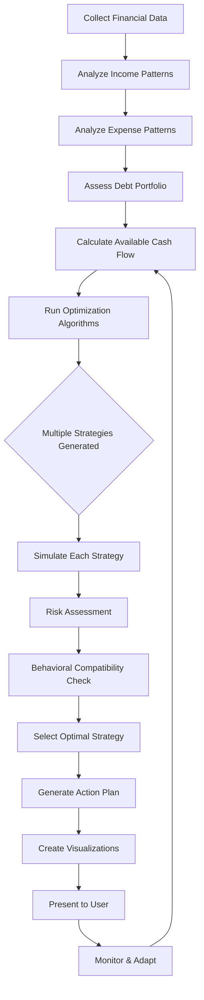

# Debt Management & Payback Prediction Component - Specification

## Overview
A comprehensive debt management system that integrates with cash flow forecasting to help users track debts, plan repayments, and visualize the impact on their financial future.

## Core Features

### 1. Debt Entry & Management
- **Add Multiple Debt Types**:
  - Credit Cards
  - Personal Loans
  - Student Loans
  - Mortgage
  - Auto Loans
  - Medical Debt
  - Business Loans
  - Family/Friend Loans
  - Other Custom Debts

- **Debt Information Fields**:
  - Creditor/Lender Name
  - Original Amount
  - Current Balance
  - Interest Rate (APR)
  - Minimum Monthly Payment
  - Payment Due Date
  - Credit Limit (for credit cards)
  - Loan Term (if applicable)
  - Categories/Tags for organization
  - Notes/Description

### 2. Repayment Strategies

#### **Smart Payback Calculator**
- **Avalanche Method**: Pay highest interest rate first
- **Snowball Method**: Pay smallest balance first
- **Custom Strategy**: User-defined priority
- **Hybrid Approach**: Mix of strategies

#### **Payment Scenarios**
- Minimum payments only
- Fixed extra payment amount
- Percentage of income allocation
- Lump sum payments
- Bi-weekly payment options
- Round-up payments

### 3. Cash Flow Integration

#### **Impact Analysis**
- Show how debt payments affect monthly cash flow
- Visualize available funds after debt obligations
- Track debt-to-income ratio
- Monitor credit utilization

#### **Payback Timeline Visualization**
```
Timeline View:
━━━━━━━━━━━━━━━━━━━━━━━━━━━━━━━━━━━━
Credit Card 1  ████████░░░░░░░ (8 months)
Auto Loan      ████████████░░░ (24 months)  
Student Loan   ████████████████ (48 months)
━━━━━━━━━━━━━━━━━━━━━━━━━━━━━━━━━━━━
```

### 4. Advanced Features

#### **Interest Savings Calculator**
- Compare different payment amounts
- Show total interest saved with extra payments
- Break-even analysis for refinancing
- Early payoff scenarios

#### **Debt Consolidation Analyzer**
- Compare consolidation options
- Calculate new monthly payments
- Show potential interest savings
- Balance transfer recommendations

#### **Smart Alerts & Recommendations**
- Payment due date reminders
- High interest rate warnings
- Suggest optimal payment distribution
- Alert when debt-free date changes
- Celebrate milestones (25%, 50%, 75% paid)

### 5. Visual Components

#### **Dashboard Cards**
```jsx
<DebtSummaryCard>
  Total Debt: $45,000
  Monthly Payment: $1,200
  Avg Interest Rate: 12.5%
  Debt-Free Date: Dec 2027
</DebtSummaryCard>
```

#### **Interactive Charts**
1. **Debt Breakdown Pie Chart**
   - By type
   - By interest rate
   - By balance

2. **Payoff Progress Bar**
   - Overall progress
   - Individual debt progress
   - Monthly payment breakdown

3. **Interest vs Principal Chart**
   - Stacked area chart showing payment allocation
   - Cumulative interest paid
   - Principal reduction over time

4. **Cash Flow Impact Graph**
   - Before/after debt payments
   - Available discretionary income
   - Emergency fund impact

### 6. Automation Features

#### **Auto-Payment Tracking**
- Sync with bank accounts (via Plaid)
- Auto-categorize debt payments
- Track extra payments
- Verify minimum payments met

#### **Smart Payment Optimizer**
- Distribute available extra funds optimally
- Adjust for variable income
- Seasonal payment adjustments
- Tax refund allocation planning

### 7. Reporting & Analytics

#### **Monthly Reports**
- Payment history
- Interest paid vs saved
- Progress toward goals
- Credit score impact estimates

#### **Annual Summary**
- Total debt reduced
- Interest saved
- Average monthly payment
- Debt-free progress percentage

### 8. Goal Setting & Gamification

#### **Debt-Free Goals**
- Set target debt-free date
- Monthly payment goals
- Balance reduction milestones
- Interest savings targets

#### **Achievement System**
- 🏆 First debt paid off
- 🎯 10% total debt reduced
- 💪 3 months of on-time payments
- 🚀 $1,000 in principal paid
- ⭐ Credit utilization under 30%

## AI-Powered Debt Analysis Engine

### Overview
An intelligent AI system that analyzes your complete financial picture—income, expenses, and debts—to create personalized, optimal repayment strategies that adapt to your changing financial situation.

### Core AI Features

#### 1. **Holistic Financial Analysis**

##### Income Analysis
- **Pattern Recognition**: Identifies income patterns (regular, irregular, seasonal)
- **Stability Score**: Calculates income reliability (0-100)
- **Growth Projection**: Predicts future income based on historical trends
- **Risk Assessment**: Identifies income vulnerabilities
- **Opportunity Detection**: Finds potential for income increase

##### Expense Analysis
- **Categorization**: Auto-categorizes and groups expenses
- **Necessity Scoring**: Ranks expenses from essential to discretionary
- **Reduction Opportunities**: Identifies areas for cost cutting
- **Seasonal Patterns**: Recognizes recurring expense patterns
- **Anomaly Detection**: Flags unusual spending

##### Cash Flow Optimization
```typescript
interface CashFlowAnalysis {
  availableForDebt: number          // After essential expenses
  flexibleAmount: number             // Could be redirected to debt
  emergencyBuffer: number            // Recommended safety margin
  optimizedPayment: number           // AI-calculated optimal payment
  confidenceScore: number            // 0-100 reliability score
}
```

#### 2. **Intelligent Repayment Strategies**

##### AI Strategy Generator
```typescript
interface AIDebtStrategy {
  strategyName: string               // "AI Optimized Plan"
  methodology: string                // Explanation of approach
  
  // Debt prioritization
  debtOrder: {
    debtId: string
    priority: number
    reasoning: string               // Why this debt is prioritized
    monthlyPayment: number
    extraPayment: number
    projectedPayoff: Date
  }[]
  
  // Financial metrics
  totalInterestSaved: number
  monthsReduced: number
  cashFlowImpact: number
  riskScore: number                 // 0-100 (lower is safer)
  
  // Adaptive elements
  adjustmentTriggers: {             // When to recalculate
    incomeChange: number            // % threshold
    expenseChange: number           // % threshold
    timeInterval: number            // Days between reviews
  }
  
  // Recommendations
  recommendations: {
    type: 'payment' | 'consolidation' | 'negotiation' | 'income' | 'expense'
    action: string
    impact: number                  // Estimated $ saved/earned
    effort: 'low' | 'medium' | 'high'
    priority: number
  }[]
}
```

##### Multi-Factor Optimization Algorithm
The AI considers multiple factors simultaneously:

1. **Interest Rate Optimization**
   - Weighted APR calculations
   - Compound interest projections
   - Variable rate predictions

2. **Psychological Factors**
   - Motivation maintenance (small wins vs. big savings)
   - Stress reduction priorities
   - Behavioral pattern analysis

3. **Risk Management**
   - Emergency fund preservation
   - Income volatility buffer
   - Unexpected expense provisions

4. **Tax Implications**
   - Deductible interest considerations
   - Tax refund planning
   - Year-end optimization

5. **Credit Score Impact**
   - Utilization ratio optimization
   - Payment history protection
   - Account age considerations

#### 3. **Adaptive Learning System**

##### Machine Learning Models

```typescript
interface MLDebtModel {
  // User behavior learning
  userProfile: {
    paymentReliability: number      // 0-1 score
    extraPaymentLikelihood: number  // Probability of making extra payments
    stressThreshold: number         // When user might skip payments
    motivationPattern: 'linear' | 'exponential' | 'stepped'
  }
  
  // Predictive models
  predictions: {
    nextMonthCashFlow: number
    threeMonthTrend: 'improving' | 'stable' | 'declining'
    yearEndPosition: number
    debtFreeDate: Date
    confidence: number
  }
  
  // Pattern recognition
  patterns: {
    spendingCycles: Period[]
    incomeVariability: number
    emergencyFrequency: number      // Unexpected expenses per year
    seasonalFactors: MonthlyFactor[]
  }
}
```

##### Continuous Improvement
- **Feedback Loop**: Learns from actual vs. predicted outcomes
- **User Preference Learning**: Adapts to individual payment behaviors
- **Market Adaptation**: Adjusts for changing interest rates and economic conditions
- **Peer Learning**: Anonymous aggregated insights from similar users

#### 4. **Scenario Analysis & Simulation**

##### What-If Simulator
```typescript
interface DebtScenario {
  name: string                       // "Aggressive Payoff", "Balanced", etc.
  
  assumptions: {
    monthlyExtraPayment: number
    incomeChange: number            // % increase/decrease
    expenseChange: number           // % increase/decrease
    interestRateChange: number      // For variable rates
    unexpectedExpenses: number[]     // Quarterly estimates
  }
  
  outcomes: {
    debtFreeDate: Date
    totalInterestPaid: number
    totalAmountPaid: number
    monthlyPaymentRange: [number, number]
    riskEvents: RiskEvent[]         // Potential problems
    successProbability: number       // 0-100%
  }
  
  visualization: {
    timeline: TimelineData
    cashFlow: CashFlowData
    progressChart: ChartData
    comparisonMatrix: ComparisonData
  }
}
```

##### Monte Carlo Simulations
- Run 1000+ scenarios with variable inputs
- Calculate probability distributions
- Identify optimal risk-adjusted strategies
- Show confidence intervals for predictions

#### 5. **Natural Language Insights**

##### AI Advisor Chat Interface
```typescript
interface AIAdvisor {
  // Conversational analysis
  async analyzeRequest(query: string): Promise<AdviceResponse>
  
  // Proactive insights
  dailyInsight(): string             // "You could save $47 this month by..."
  weeklyStrategy(): string           // Strategic recommendations
  monthlyReview(): DetailedReport    // Comprehensive analysis
  
  // Contextual help
  explainStrategy(strategyId: string): string
  answerQuestion(question: string): string
  provideAlternatives(currentPlan: string): Alternative[]
}
```

##### Example AI Insights
```text
💡 "Based on your spending patterns, I've identified that you typically 
have an extra $340 in March and September. Scheduling additional 
payments during these months could save you $1,247 in interest and 
make you debt-free 4 months earlier."

🎯 "Your variable income averaging $5,200/month with 18% volatility 
suggests keeping a $1,100 payment buffer. I recommend the modified 
avalanche approach targeting your credit card first while maintaining 
minimum payments plus $50 on other debts."

⚠️ "Warning: Your current trajectory shows a 73% chance of missing 
payments in December due to historical holiday spending increases 
of 42%. Consider reducing payments to minimum in November to build 
a buffer."
```

#### 6. **Optimization Algorithms**

##### Multi-Objective Optimization
```typescript
interface OptimizationObjectives {
  primary: {
    minimizeInterest: weight
    minimizeTime: weight
    maximizeCashFlow: weight
    minimizeRisk: weight
  }
  
  constraints: {
    minimumEmergencyFund: number
    maximumMonthlyPayment: number
    minimumQualityOfLife: number    // Preserve some discretionary spending
    creditScoreThreshold: number
  }
  
  preferences: {
    aggressiveness: 'conservative' | 'balanced' | 'aggressive'
    flexibility: 'rigid' | 'adaptive' | 'highly-flexible'
    automationLevel: 'manual' | 'semi-auto' | 'full-auto'
  }
}
```

##### Algorithm Selection
The AI automatically selects the best algorithm based on your situation:

1. **Linear Programming**: For simple, stable income/expense scenarios
2. **Dynamic Programming**: For complex, multi-period optimization
3. **Genetic Algorithms**: For highly complex scenarios with many variables
4. **Neural Networks**: For pattern recognition and prediction
5. **Reinforcement Learning**: For adaptive strategy improvement

#### 7. **Real-Time Adjustments**

##### Adaptive Response System
```typescript
interface AdaptiveResponse {
  trigger: {
    type: 'income_drop' | 'expense_spike' | 'rate_change' | 'bonus_received'
    magnitude: number
    timestamp: Date
  }
  
  analysis: {
    impact: 'low' | 'medium' | 'high'
    urgency: 'immediate' | 'this_month' | 'next_month'
    affectedDebts: string[]
  }
  
  recommendations: {
    immediate: Action[]              // Do now
    shortTerm: Action[]             // This month
    strategic: Action[]             // Long-term adjustments
  }
  
  notification: {
    method: 'push' | 'email' | 'in-app'
    message: string
    actionRequired: boolean
  }
}
```

##### Event-Driven Recalculation
- Income changes (raise, job loss, bonus)
- Expense changes (new bill, emergency)
- Interest rate changes
- Credit score improvements
- Life events (marriage, baby, move)

#### 8. **Behavioral Intelligence**

##### Psychological Profiling
```typescript
interface BehavioralProfile {
  motivationType: 'achiever' | 'competitor' | 'planner' | 'security-focused'
  
  paymentBehavior: {
    consistency: number              // 0-100
    impulsiveness: number           // 0-100
    stressResponse: 'withdrawal' | 'aggressive' | 'steady'
    rewardPreference: 'immediate' | 'delayed'
  }
  
  optimalStrategy: {
    paymentFrequency: 'weekly' | 'bi-weekly' | 'monthly'
    reminderStyle: 'gentle' | 'firm' | 'motivational'
    gamificationLevel: 'none' | 'light' | 'heavy'
    reportingDetail: 'summary' | 'detailed' | 'comprehensive'
  }
  
  nudges: {
    timing: string[]                // Best times for reminders
    messaging: string[]             // Effective message styles
    frequency: number               // Optimal touches per month
  }
}
```

##### Behavioral Nudges
- Personalized motivation messages
- Optimal payment timing suggestions
- Stress reduction strategies
- Celebration triggers for milestones
- Preventive interventions for at-risk periods

#### 9. **Integration with Financial Ecosystem**

##### Data Sources
```typescript
interface DataIntegration {
  // Internal data
  transactions: Transaction[]
  bills: Bill[]
  income: IncomeSource[]
  goals: FinancialGoal[]
  
  // External data
  creditScore: {
    score: number
    factors: ScoreFactor[]
    trajectory: Trend
  }
  
  marketData: {
    interestRates: RateEnvironment
    inflationRate: number
    unemploymentRate: number       // For risk assessment
  }
  
  peerBenchmarks: {
    similarUsers: AnonymizedProfile[]
    medianProgress: number
    successRate: number
  }
}
```

#### 10. **Reporting & Visualization**

##### AI-Generated Reports
```typescript
interface AIReport {
  executiveSummary: {
    currentStatus: string
    keyMetrics: Metric[]
    mainRecommendation: string
    confidenceLevel: number
  }
  
  detailedAnalysis: {
    incomeStability: Analysis
    expenseOptimization: Analysis
    debtStrategy: Analysis
    riskAssessment: Analysis
    opportunityIdentification: Analysis
  }
  
  projections: {
    baseCase: Projection
    bestCase: Projection
    worstCase: Projection
    mostLikely: Projection
  }
  
  actionPlan: {
    immediate: Task[]
    thisMonth: Task[]
    thisQuarter: Task[]
    thisYear: Task[]
  }
  
  visualizations: {
    strategyComparison: ChartConfig
    progressTimeline: ChartConfig
    cashFlowForecast: ChartConfig
    riskHeatmap: ChartConfig
  }
}
```

### Implementation Architecture

```typescript
// AI Service Architecture
class DebtAIService {
  // Core analysis
  async analyzeFinancialSituation(userId: string): Promise<FinancialAnalysis>
  async generateOptimalStrategy(analysis: FinancialAnalysis): Promise<AIDebtStrategy>
  async simulateScenarios(strategy: AIDebtStrategy): Promise<ScenarioResults>
  
  // Real-time adaptation
  async handleFinancialEvent(event: FinancialEvent): Promise<AdaptiveResponse>
  async recalibrateStrategy(userId: string): Promise<UpdatedStrategy>
  
  // Machine learning
  async trainUserModel(userId: string, historicalData: Data[]): Promise<void>
  async predictOutcomes(strategy: AIDebtStrategy): Promise<Predictions>
  
  // Natural language
  async generateInsight(userId: string, context: Context): Promise<string>
  async answerQuery(query: string, userId: string): Promise<Response>
  
  // Reporting
  async generateReport(userId: string, type: ReportType): Promise<AIReport>
  async createVisualization(data: Data, type: ChartType): Promise<ChartConfig>
}
```

### AI Decision Flow



### Benefits of AI Integration

1. **Personalized Strategies**: No two plans are alike
2. **Dynamic Adaptation**: Adjusts to life changes automatically
3. **Predictive Insights**: Anticipates problems before they occur
4. **Optimal Outcomes**: Mathematically optimized for your goals
5. **Behavioral Support**: Understands and works with your psychology
6. **Time Savings**: Hours of analysis in seconds
7. **Continuous Learning**: Gets smarter over time
8. **Risk Mitigation**: Identifies and prevents potential issues

### Database Schema
```sql
-- Debts table
CREATE TABLE debts (
  id UUID PRIMARY KEY,
  user_id UUID REFERENCES users(id),
  creditor_name TEXT NOT NULL,
  debt_type TEXT NOT NULL,
  original_amount DECIMAL(10, 2),
  current_balance DECIMAL(10, 2) NOT NULL,
  interest_rate DECIMAL(5, 2),
  minimum_payment DECIMAL(10, 2),
  due_date INTEGER, -- Day of month
  credit_limit DECIMAL(10, 2), -- For credit cards
  loan_term_months INTEGER,
  categories JSONB DEFAULT '[]',
  is_active BOOLEAN DEFAULT true,
  created_at TIMESTAMP DEFAULT NOW(),
  updated_at TIMESTAMP DEFAULT NOW()
);

-- Debt payments table
CREATE TABLE debt_payments (
  id UUID PRIMARY KEY,
  debt_id UUID REFERENCES debts(id),
  payment_date DATE NOT NULL,
  amount DECIMAL(10, 2) NOT NULL,
  principal_amount DECIMAL(10, 2),
  interest_amount DECIMAL(10, 2),
  remaining_balance DECIMAL(10, 2),
  is_extra_payment BOOLEAN DEFAULT false,
  notes TEXT,
  created_at TIMESTAMP DEFAULT NOW()
);

-- Debt strategies table
CREATE TABLE debt_strategies (
  id UUID PRIMARY KEY,
  user_id UUID REFERENCES users(id),
  strategy_name TEXT NOT NULL,
  strategy_type TEXT CHECK (strategy_type IN ('avalanche', 'snowball', 'custom', 'hybrid')),
  extra_payment_amount DECIMAL(10, 2),
  payment_allocation JSONB, -- Custom priority for debts
  is_active BOOLEAN DEFAULT false,
  created_at TIMESTAMP DEFAULT NOW()
);
```

### Component Structure
```typescript
// Main component
<DebtManagement>
  <DebtDashboard />
  <DebtList />
  <PaybackCalculator />
  <CashFlowImpact />
  <DebtStrategy />
  <PaymentSchedule />
</DebtManagement>

// Sub-components
<AddDebtModal />
<DebtCard />
<PaymentSimulator />
<InterestCalculator />
<ProgressTracker />
<DebtFreeCountdown />
```

### API Endpoints
```typescript
// Debt CRUD
POST   /api/debts          // Create new debt
GET    /api/debts          // List all debts
PUT    /api/debts/:id      // Update debt
DELETE /api/debts/:id      // Delete debt

// Payments
POST   /api/debts/:id/payments     // Record payment
GET    /api/debts/:id/payments     // Payment history
PUT    /api/debts/:id/payments/:id // Update payment

// Strategies
POST   /api/debt-strategies         // Create strategy
GET    /api/debt-strategies         // Get strategies
PUT    /api/debt-strategies/:id     // Update strategy
POST   /api/debt-strategies/simulate // Simulate payoff

// Analytics
GET    /api/debts/analytics         // Overall analytics
GET    /api/debts/forecast          // Payoff forecast
GET    /api/debts/recommendations  // AI recommendations
```

## User Experience Flow

### 1. Initial Setup
1. User clicks "Add Debt" button
2. Selects debt type from dropdown
3. Enters debt details (balance, rate, minimum)
4. System calculates payoff timeline
5. Shows impact on monthly cash flow

### 2. Strategy Selection
1. User views all debts in dashboard
2. Clicks "Optimize Payoff Strategy"
3. Compares different methods (avalanche vs snowball)
4. Sees projected savings and timeline
5. Selects preferred strategy

### 3. Monthly Management
1. Dashboard shows upcoming payments
2. User can mark payments as made
3. Track extra payments
4. View progress toward debt-free goal
5. Adjust strategy as needed

### 4. Progress Monitoring
1. Monthly email reports
2. Push notifications for due dates
3. Milestone celebrations
4. Annual progress review
5. Recommendations for optimization

## Integration Points

### With Existing Features
- **Bills Management**: Debt payments appear as bills
- **Financial Forecasting**: Include debt in cash flow projections
- **Income Management**: Calculate debt-to-income ratio
- **Transactions**: Auto-categorize debt payments
- **Financial Goals**: Set debt reduction goals

### External Services
- **Credit Score APIs**: Track score improvements
- **Bank Connections**: Auto-import payments
- **Interest Rate APIs**: Refinancing recommendations
- **Notification Services**: Payment reminders

## Benefits

### For Users
1. **Clear Payoff Timeline**: Know exactly when you'll be debt-free
2. **Interest Savings**: Optimize payments to save thousands
3. **Better Cash Flow**: Understand impact on monthly budget
4. **Reduced Stress**: Automated tracking and reminders
5. **Achievement Motivation**: Gamification keeps users engaged

### For Business
1. **User Retention**: Long-term engagement with debt payoff
2. **Premium Features**: Advanced strategies for paid tiers
3. **Data Insights**: Understand user financial behavior
4. **Partnership Opportunities**: Debt consolidation referrals
5. **Cross-selling**: Related financial products

## Success Metrics

### Key Performance Indicators
- Average debt reduction per user per month
- Percentage of users making extra payments
- User engagement with payoff calculator
- Payment on-time rate
- Strategy completion rate

### User Satisfaction Metrics
- Feature usage frequency
- User feedback scores
- Debt-free achievement rate
- Referral rate
- Premium conversion rate

## Future Enhancements

### Phase 2 Features
- AI-powered payment optimization
- Debt negotiation assistance
- Credit score simulator
- Refinancing marketplace
- Peer comparison (anonymous)
- Debt support community
- Financial advisor consultation
- Automated debt payoff via smart contracts

### Phase 3 Features
- Machine learning for payment prediction
- Behavioral nudges for extra payments
- Integration with investment accounts
- Tax optimization for debt payments
- International currency support
- Business debt management
- Family debt sharing/splitting
- Debt inheritance planning

## Technical Considerations

### Performance
- Lazy load historical payment data
- Cache calculation results
- Optimize chart rendering
- Background processing for simulations

### Security
- Encrypt sensitive financial data
- Secure payment information storage
- Audit trail for all changes
- PCI compliance for payment processing

### Scalability
- Microservice for calculation engine
- Queue system for bulk operations
- CDN for static assets
- Database indexing for queries

## Summary

This enhanced Debt Management component with AI integration will transform how users handle debt by providing:
- Comprehensive debt tracking
- **AI-powered optimization that analyzes income, expenses, and debts holistically**
- **Machine learning that adapts to user behavior and market conditions**
- **Predictive analytics to anticipate and prevent problems**
- **Personalized strategies that evolve with changing circumstances**
- **Natural language insights that explain complex financial decisions**
- Clear visualization of progress
- Integration with cash flow
- Motivational gamification
- Actionable insights

The AI system empowers users to become debt-free faster while maintaining financial stability through intelligent analysis, adaptive strategies, and continuous optimization based on their complete financial picture.